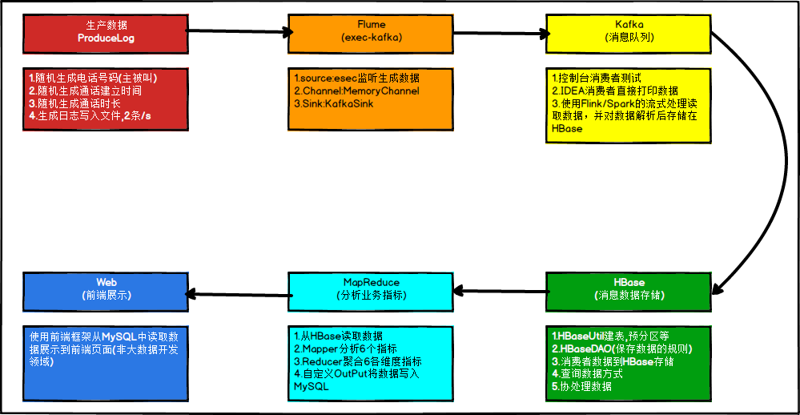

# 项目架构
需求：统计每天、每月、以及每年的每个人的通话次数及时长。看下我们的架构：

# 项目实现
## 数据生产
此情此景，对于该模块的业务，即数据生产过程，一般并不会让你来进行操作，数据生产是一套完整且严密的体系，这样可以保证数据的鲁棒性。但是如果涉及到项目的一体化方案的设计（数据的产生、存储、分析、展示），则必须清楚每一个环节是如何处理的，包括其中每个环境可能隐藏的问题；数据结构，数据内容可能出现的问题。
## 数据结构
我们将在HBase中存储两个电话号码，以及通话建立的时间和通话持续时间，最后再加上一个flag作为判断第一个电话号码是否为主叫。姓名字段的存储我们可以放置于另外一张表做关联查询，当然也可以插入到当前表中。

| 列名         | 解释                         | 举例           |
| ------------ | ---------------------------- | -------------- |
| call1        | 第一个手机号码               | 15369468720    |
| call1_name   | 第一个手机号码人姓名(非必须) | 李雁           |
| call2        | 第二个手机号码               | 19920860202    |
| call2_name   | 第二个手机号码人姓名(非必须) | 卫艺           |
| date_time    | 建立通话的时间               | 20171017081520 |
| date_time_ts | 建立通话的时间（时间戳形式） |                |
| duration     | 通话持续时间（秒）           | 0600           |

### 代码设计
> a).创建Java集合类存放模拟的电话号码和联系人
>
> b).随机选取两个手机号码当作“主叫”与“被叫”（注意判断两个手机号不能重复），产出call1与call2字段数据
>
> c).创建随机生成通话建立时间的方法，可指定随机范围，最后生成通话建立时间，产出date_time字段数据;
>
> d).随机一个通话时长，单位：秒，产出duration字段数据;
>
> e).将产出的一条数据拼接封装到一个字符串中;
>
> f).使用IO操作将产出的一条通话数据写入到本地文件中.
>

## 消费者消费数据（均保存在HBase）

### SparkStreaming消费Kafka数据

### Flink消费Kafka数据

### 直接读取Kafka数据

